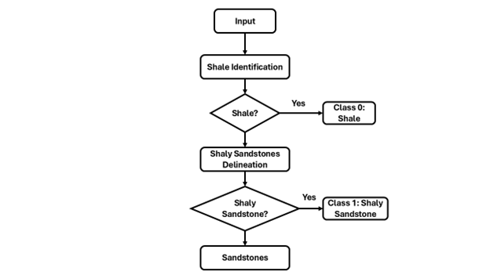
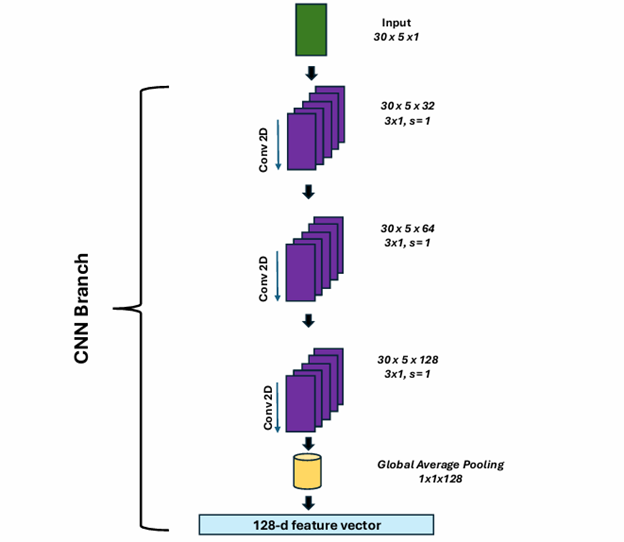
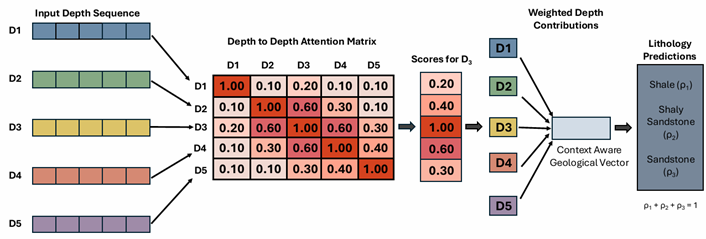

# LNUQNet: An Uncertainty-Aware Deep Learning Model for Lithology Classification

[]

## Overview

LNUQNet (Lithology Neural Uncertainty Quantification Network) is an uncertainty-aware deep learning framework designed for automated lithology classification with predictive uncertainty estimation.
The model integrates convolutional neural network (CNN) feature extraction with transformer-based contextual learning to capture both local geological patterns and global stratigraphic dependencies.

To quantify predictive uncertainty, the framework employs Monte Carlo Dropout during inference, enabling probabilistic lithology predictions that can support more reliable geological interpretation.

This repository contains the code, trained model, and datasets used to develop and evaluate LNUQNet.

---

## Repository Structure

LNUQNet/

* notebooks/

  * LNUQNet_1_RBHS.ipynb – Rule-Based Hierarchical System (RBHS) pipeline for generating ground truth labels
  * LNUQNet_2_Model.ipynb – Model architecture definition and training
  * LNUQNet_3_Uncertainty_Quantification_and_Plots.ipynb – Prediction, uncertainty estimation, and visualization

* models/

  * best_lnuqnet_model.keras – Trained LNUQNet model

* data/

  * Contains the 12 datasets used for model development and evaluation

* figures/

  * RBHS_framework.png
  * cnn_architecture.png
  * depthwise_self_attention.png

* requirements.txt – Python dependencies required to run the notebooks

---

## Installation

Install the required Python packages:

pip install -r requirements.txt

---

## Usage

Run the notebooks sequentially:

1. **LNUQNet_1_RBHS.ipynb**

* Ground truth generation using the Rule-Based Hierarchical System (RBHS)
* Dataset preparation

2. **LNUQNet_2_Model.ipynb**

* Implementation of the LNUQNet architecture
* Model training

3. **LNUQNet_3_Uncertainty_Quantification_and_Plots.ipynb**

* Lithology prediction
* Monte Carlo Dropout uncertainty estimation
* Visualization of predictions and uncertainty

---

## Model Architecture

### RBHS Ground Truth Generation Framework

The Rule-Based Hierarchical System (RBHS) is used to generate structured lithology labels from well log measurements. This framework encodes geological domain knowledge through hierarchical decision rules to produce consistent training labels.

---

### CNN Feature Extraction Architecture

The CNN component extracts local lithological patterns from well log features. Convolutional layers capture spatial relationships within the input feature window.

---

### Depthwise Self-Attention Mechanism

The transformer-based depthwise self-attention mechanism captures long-range depth dependencies within the well log sequence, enabling the model to learn stratigraphic context.

---

## Model Description

The LNUQNet architecture combines:

* Convolutional neural networks for local lithological feature extraction
* Transformer-based attention mechanisms for capturing depth-wise contextual relationships
* Monte Carlo Dropout for uncertainty quantification

This hybrid design enables robust lithology prediction while providing confidence estimates for each classification.

---

## Results

LNUQNet demonstrates strong lithology classification performance while also providing predictive uncertainty estimates through Monte Carlo Dropout.

The model was evaluated on both the training and test datasets, and the following performance metrics were obtained:

| Data Split | Accuracy |
| ---------- | -------- |
| Train      | 0.96     |
| Test       | 0.78     |

In addition to classification performance, LNUQNet produces probabilistic predictions that allow estimation of model confidence.

| Uncertainty Metric         | Value  |
| -------------------------- | ------ |
| Mean Prediction Confidence | > 0.91 |

The high mean confidence indicates that the model generally produces strong probabilistic certainty in its predictions, while the uncertainty estimates help identify predictions that may require further geological review.

---

## Data

All datasets used in the study are provided in the **data/** folder.

---

## Reproducibility

To reproduce the results:

1. Install dependencies
2. Run the notebooks sequentially
3. Use the provided trained model or retrain using the training notebook

---

## Citation

If you use this code in your research, please cite:

Author(s).
"LNUQNet: An Uncertainty-Aware Deep Learning Model for Lithology Classification."
